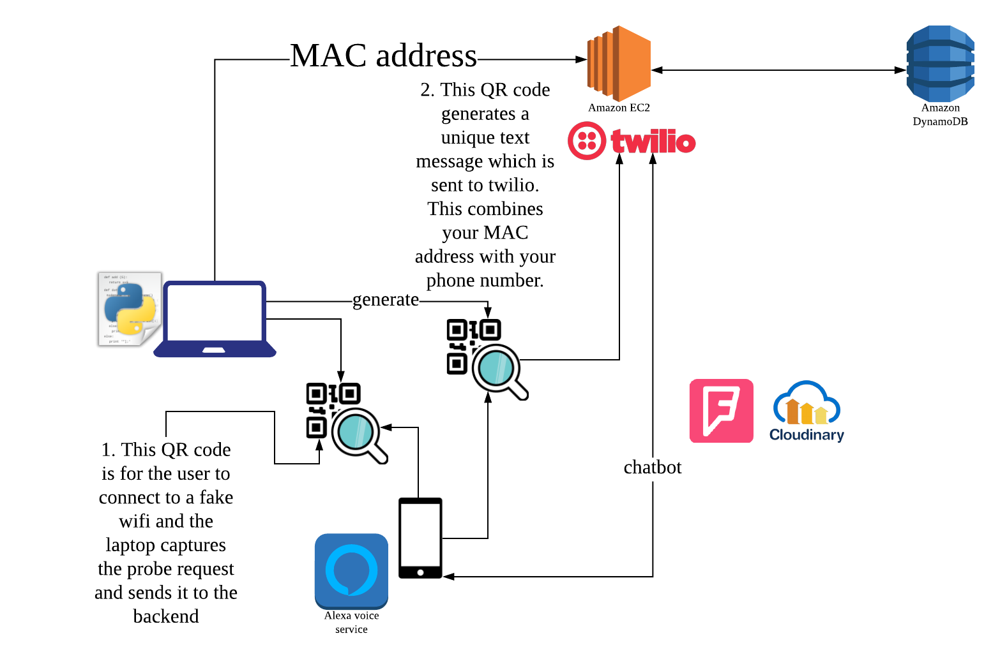

# hackmidwest2018

Sonder is a proximity-based multi-purpose private network with applications in home automation,  event planning and anonymous communication, enabled through text-based (SMS) virtual assistant.  It allows user to anonymously interact with authorized peers. 

The problem is every virtual automation assistance needs wifi to communicate with each other, we want to make a AP-less virtual automation. The main idea is to use cellular services to interact with a central hub to process information in areas such as home/office, social gatherings and hackathons. We want to communicate in a shared space with single text message authentication and ensure anonymity. In addition, we wanted a more fool-proof way to determine user proximity.

The coolest part in our hack is using the wifi probe request to get nearby device MAC address for user authentication. We have two QR codes and they help us to combine phone and MAC address. We use AWS EC2 as a backend server and DynamonDB as database to save records for each user. After user authenticated into our system, we will use Twilio API to interact with users. In our hack, we allow users to do announcements, send private message, find places of interest around us, identify people or objects in a scene or photos. We also developed an Alexa Skill to use Alexa for querying the backend database.

## My work

1. Nodejs backend implementation and design DynamoDB schema
2. POC on Alexa Skills, enabled alexa and dynamoDB connection
